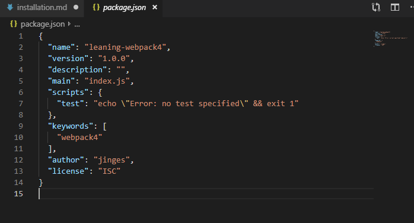
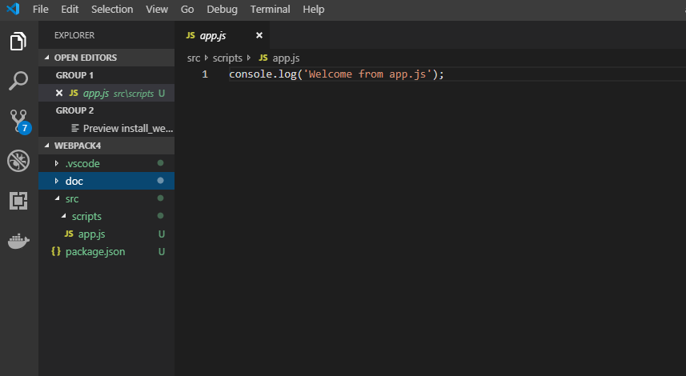

/*
 * @Author: 大明冯 
 * @Date: 2019-07-05 09:42:36 
 * @Last Modified by: 大明冯
 * @Last Modified time: 2019-07-05 15:46:58
 */

1,打开 ` terminal /command prompt`, cd 选择存放项目的目录；

2, 用  `mkdir learning-webpack4` 命令，创建一个文件夹 learning-webpack4, 并用 cd  进入这个文件夹里。

3,命令行输入 `npm  init` 初始化设置，根据命令行提示输入项目信息，最后输入 yes 完成package.json的设置。

4, 最后，打开开发工具（这里用vs code）。在控制台输入 ` code . `启动 vs code 打开项目。可以查看前面用命令行创建的package.json文件： （如图）



5,创建一个文件夹和一个js文件, 并命名为app.js


6, 在app.js里输入以下内容
```javascript
console.log('Welcome from app.js')
```